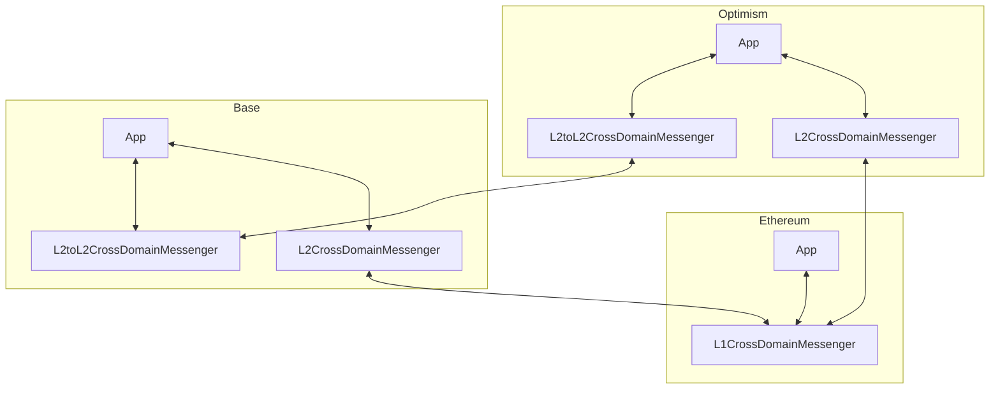
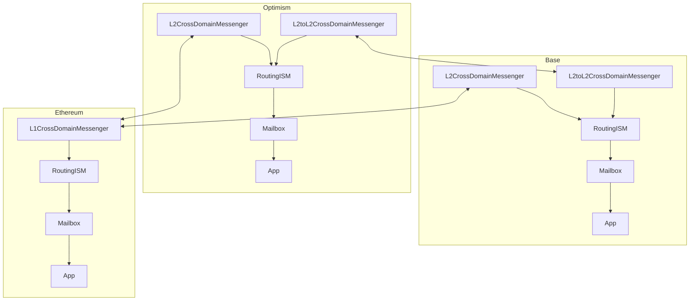
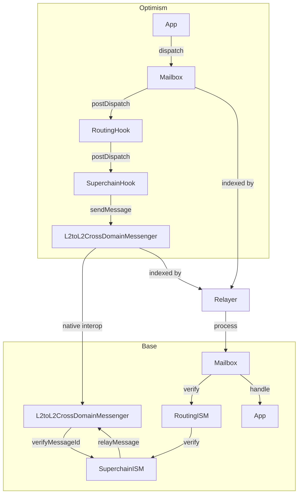

# Hyperlane DevEx Demo

This document outlines a demo of what the developer experience could be when using Hyperlane as a wrapper over OP's Native Interop.

## Context

OP's Native Interop allows developers to send cross-chain messages and native msg.value without taking on additional trust assumptions (beyond what the rollups themselves take on). However, a challenging aspect of any cross-chain messaging protocol is the need for the 2nd executing transaction. In Hyperlane's experience, exposing that complexity to users is very undesirable, and in practice a dedicated entity has to take on this task (and be paid for it). This demo showcases how a Hyperlane wrapper could allow Hyperlane relayers (which are completely permissionless) to do that work for OP native interop developers.

This demo demonstrates the basic ergonomics for developers and how a relayer would work. Additional improvements to the demonstration including integrating the actual native interop trust assumptions are marked under [Future Improvements](#future-improvements)

## Setup

1. Follow the `supersim` setup guide and run supersim
2. Install the hyperlane cli `npm install -g @hyperlane-xyz/cli@5.6.0-superchain.1`
3. Set the private key for usage in subsequent demand in our shell. We are going to use the last default account (since the earlier ones seem to have nonce issues) `export HYP_KEY=0x2a871d0798f97d79848a013d4936a73bf4cc922c825d33c1cf7073dff6d409c6`
4. Deploy Hyperlane on OpChainA `hyperlane core deploy --chain opchaina --yes --overrides ./integrations/hyperlane/hyperlane-registry --config $(pwd)/integrations/hyperlane/core-config.yaml`
5. Deploy Hyperlane on OpChainB `hyperlane core deploy --chain opchainb --yes --overrides ./integrations/hyperlane/hyperlane-registry --config $(pwd)/integrations/hyperlane/core-config.yaml`
6. Deploy the Superchain specific contracts with `hyperlane deploy-superchain-contracts --overrides $(pwd)/integrations/hyperlane/hyperlane-registry`. This will deploy the SuperchainHook and SuperchainISM and will set it as the default for messages sent via the Hyperlane mailbox.
7. In a separate process (with the key again set as per Step 3.), you can run the relayer with `hyperlane relayer --chains opchaina,opchainb --overrides $(pwd)/integrations/hyperlane/hyperlane-registry`.
8. Send a message via Hyperlane with `hyperlane send message --origin opchaina --destination opchainb --body "Hello from OpChainA via Hyperlane-enabled native interop" --overrides $(pwd)/integrations/hyperlane/hyperlane-registry`. This will call the [`Mailbox#dispatch`](https://github.com/hyperlane-xyz/hyperlane-monorepo/blob/main/solidity/contracts/Mailbox.sol#L102) function (think of it similar to CrossDomainMessenger's sendMessage function) with a [`TestRecipient`](https://github.com/hyperlane-xyz/hyperlane-monorepo/blob/f7333794883759dda9dc45b1ce56ce2452e93785/solidity/contracts/test/TestRecipient.sol#L30) as the receiver of that message. You should observe that the relayer automatically processes the previously dispatched message, without the message sender (i.e. the application), nor the user needing to do anything on the destination chain. You should also see in the Supersim logs that the message was secured using native interop, i.e. no additional trust assumptions had to be taken on.

## Architecture

Let's start with the OP Stack native cross chain messaging smart contracts (both existing + the new L2-L2 native interop) 

Besides the actual cross-chain application logic, an application developer who wants to build with native OP Stack cross chain messaging will need to account for two considerations:

1. The developer has to route `sendMessage` across the different CrossDomainMessengers inside the application contract (`L1CrossDomainMessenger`, `L2CrossDomainMessenger`, `L2toL2CrossDomainMessenger`) with similar, but slightly different interfaces and semantics.
2. The developer has to route calls from the origin chain sender and permission them differently with again similar, but slightly different semantics (`crossDomainMessageSender` vs. `xDomainMessageSender`)
3. The developer to has to account for different relaying (complete the message on the destination chain) semantics (L1 -> L2 is part of the STF, L2 -> L1 requires fetching the merkle proof, L2 -> L2 requires the origin log emission).

With Hyperlane:

Hyperlane's experience with heterogenous interoperability verification and it's higher-level abstractions allow developers to separate the interoperability concerns from their application contracts. It also allows the delegation of the relaying responsability to an external party best suitable for relaying with an open source Hyperlane relayer.

And to show it in a bit more detail for using the `SuperchainHook` and `SuperchainISM` specifically:

Aside from these benefits, using the Hyperlane interface allows application developers to build and deploy their contracts now, but upgrade into Superchain trust assumptions when they become available (for the chains they will be available on).

## Future Improvements

- Integrate with TicTacToe.sol to show integration
- Deploy Interchain Gas Paymaster to demonstrate seamless relayer payments by the message sender